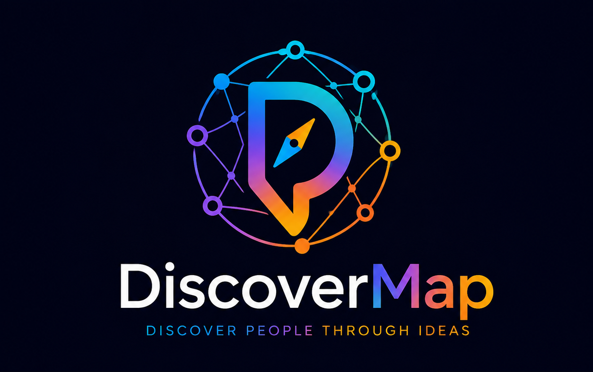

  

<h1 align="center">DiscoverMap</h1>

Open Source Social Media Discovery Platform

# DiscoverMap

DiscoverMap is an open-source social media discovery platform.

Instead of following people, users explore ideas.

The platform organizes content into interactive maps based on topics, communities, and interests.

## Features

- Discover creators by topic
- Community driven categorization
- Cross-platform content discovery
- Open recommendation system
- AI assisted content organization

## Status

🚧 Early MVP Development

## Tech Stack

- React
- Next.js
- Supabase
- PostgreSQL
- TypeScript

## License

MIT
